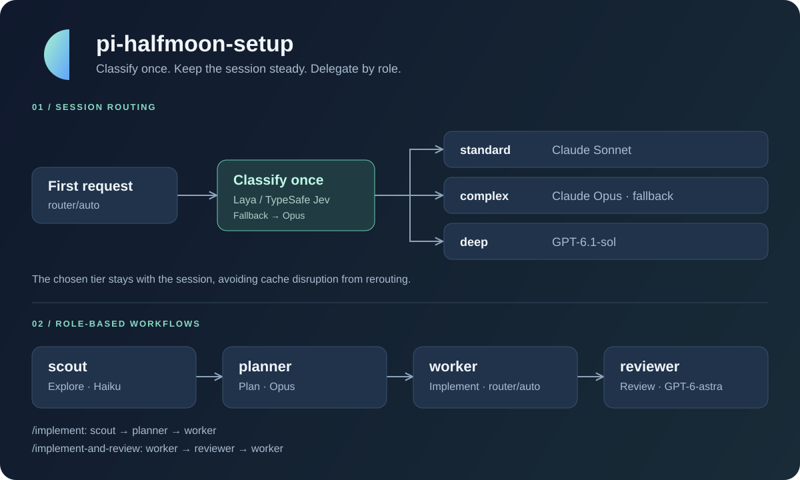

# pi-halfmoon-setup

[English](README.md) | **한국어**

[](https://github.com/halfmoon-mind/pi-halfmoon-setup/actions/workflows/test.yml)
[](LICENSE)

**첫 요청으로 모델을 고르고, 역할별 에이전트로 작업을 나누는 개인용 [pi](https://pi.dev) 설정 패키지.**

여러 머신에서 같은 모델 라우터, 서브에이전트, 워크플로 프롬프트를 사용할 수 있습니다. `router/auto`는 첫 사용자 메시지를 한 번 분류하고 세션 동안 선택한 티어를 유지해, 반복적인 모델 전환으로 프롬프트 캐시가 깨지는 일을 피합니다.



## 주요 기능

- **세션 단위 라우팅** — 일반 작업, 복잡한 설계, 논리 중심 문제에 서로 다른 모델을 배정합니다.
- **역할별 서브에이전트** — 탐색·계획·구현·리뷰를 독립된 컨텍스트에서 수행합니다.
- **워크플로 명령어** — `/implement`, `/scout-and-plan`, `/implement-and-review`로 작업을 연결합니다.
- **종료 전 리뷰 게이트** — pi가 멈추기 전에 다른 모델 계열이 프롬프트의 변경을 리뷰하고, 막히는 문제는 다시 돌려보냅니다.
- **Claude CLI 연동** — 로그인된 `claude` CLI를 pi의 모델 프로바이더로 사용합니다.
- **선택적인 로컬 분류기** — Laya를 자동 시작·종료하고, 분류할 수 없으면 Opus로 진행합니다.

## 빠른 시작

### 1. 준비 및 설치

`pi`와 Claude Code의 `claude` 명령어가 PATH에 있어야 합니다. 이 저장소는 독립 실행 앱이 아니라 pi에 로드하는 패키지입니다.

```bash
pi install git:github.com/halfmoon-mind/pi-halfmoon-setup
claude auth login
```

로컬 체크아웃을 사용하려면 다음처럼 설치합니다. 수정 후 pi에서 `/reload`로 다시 로드할 수 있습니다.

```bash
pi install ~/projects/pi-halfmoon-setup
```

`deep-high` 티어, `reviewer`·`plan-reviewer` 에이전트, 리뷰 게이트는 `openai` 프로바이더를 사용합니다. 해당 프로바이더의 인증도 준비해야 합니다. 환경변수로 설정하는 경우:

```bash
export OPENAI_API_KEY="<your-api-key>"
```

### 2. Laya 설치 (선택)

자동 분류를 사용하려면 Laya 서버를 설치합니다.

```bash
pip install "laya[serve]"
```

가상환경 등에 설치해 `laya-serve`가 PATH에 없다면 실행 파일 경로를 지정합니다. 아래 경로는 자신의 설치 위치로 바꾸세요.

```bash
export LAYA_SERVE_BIN="$HOME/projects/laya/.venv/bin/laya-serve"
```

Laya가 없어도 라우터는 `complex` 티어의 Opus를 사용합니다. 분류 없이 사용할 계획이라면 pi 안에서 `/laya off`를 실행하면 됩니다.

### 3. 실행

```bash
pi --model router/auto
```

실행 중에는 `/model`로 `router/auto`를 선택할 수도 있습니다. Laya를 사용하는 경우 `/laya`로 상태를 확인합니다.

## 사용 예시

pi 입력창에서 프롬프트 명령어 뒤에 작업을 적습니다.

```text
/scout-and-plan 로그인 흐름을 조사하고 세션 만료 처리 개선 계획을 세워줘
/implement 설정 파일에 테마 옵션을 추가해줘
/implement-and-review API 응답 파싱 오류를 수정하고 리뷰해줘
/deep 동시 요청에서도 토큰 버킷 rate limiter가 한도를 지키게 해줘
```

| 명령어 | 실행 순서 | 결과 |
|---|---|---|
| `/scout-and-plan` | scout → planner → plan-reviewer | 코드 탐색 및 리뷰를 거친 구현 계획. 구현은 하지 않음 |
| `/implement` | scout → planner → plan-reviewer → worker | 탐색, 계획, 계획 리뷰를 거쳐 구현 |
| `/implement-and-review` | worker → reviewer → worker | 구현, 리뷰, 리뷰의 Critical 항목 수정 |
| `/deep` | deep-worker (에스컬레이션 시 → worker) | 논리 중심 목표 하나를 GPT-6.1 Sol로 처리하고, 근거로 정할 수 없는 결정은 worker에게 넘김 |

프롬프트는 `subagent` 도구의 `chain` 모드를 사용하고 `{previous}`로 앞 단계의 출력을 전달합니다. 도구 자체는 단일 에이전트 실행(`agent` + `task`), 병렬 실행(`tasks`), 순차 실행(`chain`)을 지원합니다.

## 모델 선택

### 라우터 티어

| 티어 | 모델 설정 | 대상 작업 |
|---|---|---|
| `standard` | `pi-claude-cli/claude-sonnet-*` | 일반 기능 개발, 버그 수정, 리뷰, 문서, 질문 |
| `complex` | `pi-claude-cli/claude-opus-*` | 복잡한 설계, 여러 영역의 리팩터링, 어려운 디버깅. **기본 폴백** |
| `deep` | `pi-claude-cli/claude-opus-*` | 알고리즘, 백엔드 내부 구조, 수학 등 논리 중심 작업 |
| `complex-high` | `pi-claude-cli/claude-fable-*` | 난이도가 `xhigh`인 `complex` 작업 |
| `deep-high` | `openai/gpt-6-astra` | 난이도가 `xhigh`인 `deep` 작업 |

oh-my-openagent의 모델 순서를 따라 Opus를 기본으로 씁니다. 매우 어렵다(`xhigh`)고 판단한 작업만 최상위 모델로 올라가며, 설계는 Fable, 논리는 GPT-6 Astra로 갑니다. 분류기가 `-high` 티어를 직접 고르지는 않으며, 올라간 세션은 끝까지 그 모델을 유지합니다.

Claude의 `-*` 설정은 등록된 모델 카탈로그에서 해당 계열의 최신 숫자 버전을 선택합니다. 날짜가 붙은 스냅샷은 제외하므로, 실제 모델 버전은 pi의 카탈로그에 따라 달라집니다.

분류기는 첫 사용자 메시지의 최대 16,000자를 사용합니다. 선택된 답의 확률이 `0.5` 미만이거나 분류기에 접근할 수 없으면 `complex`를 사용합니다. `/laya off` 상태에서도 같은 티어를 사용합니다. 이는 **분류 실패에 대한 폴백**이며, 선택된 모델의 인증·호출 실패 시 다른 프로바이더로 전환하는 기능은 아닙니다.

같은 분류에서 요청의 난이도도 0~3점으로 함께 매겨, 세션의 thinking level을 `low`, `medium`, `high`, `xhigh` 중 하나로 정합니다. Laya가 2.5를 넘는 점수를 거의 주지 않아 `xhigh`는 2.15점부터입니다. pi에서 thinking level을 직접 바꾸면 그 세션의 나머지 동안은 사용자가 고른 값을 씁니다. 분류기가 답하지 못하거나 Laya가 꺼져 있으면 처음부터 사용자가 정한 값을 씁니다.

### 에이전트

| 에이전트 | 모델 설정 | 역할 |
|---|---|---|
| `scout` | `pi-claude-cli/claude-haiku` | 코드를 읽고 관련 파일과 핵심 맥락을 정리 |
| `planner` | `pi-claude-cli/claude-opus:high` | 탐색 결과와 요구사항으로 구현 계획 작성 |
| `plan-reviewer` | `openai/gpt-6-astra:xhigh` | worker가 실행하기 전에 다른 모델 계열로 계획의 막히는 문제를 고침 |
| `worker` | `router/auto` | 할당된 작업을 분류해 구현 |
| `deep-worker` | `openai/gpt-6.1-sol:medium` | 테스트로 확인할 수 있는 논리 중심 목표 하나를 구현하거나 `ESCALATE`로 답함 (oh-my-openagent의 deep-low 레인) |
| `reviewer` | `openai/gpt-6-astra:high` | 다른 모델 계열로 코드 품질과 보안 리뷰 |

에이전트의 Claude 모델명은 부분 이름이며 pi가 해석합니다. 역할과 모델은 [`agents/`](agents/)의 Markdown 파일에서 설정합니다. `subagent` 도구가 에이전트 목록과 `description`을 모델에 보여 주므로, 메인 모델이 논리 중심 하위 작업을 `deep-worker`에 맡기는 식으로 스스로 위임할 수 있습니다. 에이전트를 추가한 뒤에는 `/reload`를 실행하세요.

기본 `agentScope: "user"`는 패키지 에이전트와 `~/.pi/agent/agents/`를 로드하며, 같은 이름이면 사용자 설정이 우선합니다. 프로젝트의 `.pi/agents/`까지 사용하려면 도구 호출에 `agentScope: "both"`를 지정합니다. 이때 프로젝트 설정이 가장 우선합니다. `agentScope: "project"`는 프로젝트 에이전트만 로드합니다.

### 리뷰 게이트

Claude Code에서 Codex 플러그인이 하는 종료 전 리뷰와 같습니다. 프롬프트 실행 중에 저장소가 바뀌었으면, pi가 멈추기 전에 `reviewer` 에이전트가 그 변경을 리뷰합니다. 첫 줄은 `ALLOW` 또는 `BLOCK`이고, `BLOCK`이면 문제를 고치거나 문제가 아닌 이유를 설명하라는 메시지와 함께 모델로 돌아갑니다. 프롬프트당 리뷰는 최대 3번이고, 실패하거나 시간 초과된 리뷰는 막지 않으며, 대화형 세션만 대상이라 서브에이전트가 자기 자신을 리뷰하지는 않습니다. 리뷰 중에는 하단 표시줄에 `reviewing…`이 보이며, Esc로는 멈출 수 없지만 10분이 지나면 끝납니다.

| pi 명령어 | 동작 |
|---|---|
| `/review-gate` | 게이트가 켜져 있는지 표시 |
| `/review-gate on` | 게이트 켜기 (기본값) |
| `/review-gate off` | 같은 설정 디렉터리를 쓰는 모든 pi에서 게이트 끄기 |

## 분류기 설정

기본값은 로컬 Laya입니다. pi의 TypeSafe Jev 클라이언트를 로컬 서버에 연결하므로 두 모드 모두 분류기 식별자가 `typesafe/jev-latest`로 표시될 수 있습니다.

| 환경변수 | 기본값 | 설명 |
|---|---|---|
| `PI_ROUTER_CLASSIFIER` | `laya` | 로컬 `laya` 또는 TypeSafe `jev` |
| `LAYA_URL` | `http://127.0.0.1:8000/v1` | Laya 서버 주소. 호스트가 `127.0.0.1` 또는 `localhost`일 때만 프로세스를 자동 관리 |
| `LAYA_SERVE_BIN` | `laya-serve` | 자동 실행할 서버의 실행 파일 경로 |
| `LAYA_MODELS` | `english` | 자동 시작하는 Laya 서버에 전달할 모델 설정 |
| `TYPESAFE_API_KEY` | 없음 | `jev` 모드에서 사용할 API 키 |

TypeSafe Jev를 사용하려면 pi를 시작하기 전에 설정합니다.

```bash
export PI_ROUTER_CLASSIFIER=jev
export TYPESAFE_API_KEY="<your-api-key>"
pi --model router/auto
```

### Laya 수명과 상태

- `router/auto` 세션 시작 또는 모델 선택 시 로컬 서버를 미리 시작합니다.
- 분류 이후 5분 동안 사용하지 않으면 자신이 시작한 서버를 종료하고, 필요할 때 다시 시작합니다.
- pi 종료·리로드 시 서버를 정리하며, 별도 lifeline 프로세스가 비정상 종료 시에도 서버를 종료하도록 구성되어 있습니다.
- 시작 대기 제한은 30초입니다. 코드에 기록된 측정치는 콜드 스타트 약 10초, 메모리 약 2.5GB이며 환경에 따라 달라집니다.

| pi 명령어 | 동작 |
|---|---|
| `/laya` | 현재 상태 표시 |
| `/laya on` | 분류 활성화 및 서버 시작 재시도 |
| `/laya off` | 분류 비활성화 및 로컬 Laya 종료 |

스위치는 기본적으로 `~/.pi/agent/laya.json`에 저장되어 같은 설정 디렉터리를 사용하는 pi 인스턴스에 적용됩니다. `PI_CODING_AGENT_DIR`을 설정하면 저장 위치도 달라집니다. 이미 라우팅된 세션은 선택한 티어를 유지하므로 변경된 분류 동작은 새 세션에서 확인하세요.

푸터에는 `laya starting`, `laya on`, `laya idle`, `laya unavailable`, `laya off` 상태가 표시됩니다. `/laya off`는 해당 로컬 포트에서 실행 중인 다른 pi 또는 수동 실행의 `laya-serve`도 종료할 수 있습니다.

## 문제 해결

| 증상 | 확인할 사항 |
|---|---|
| `laya unavailable` 또는 서버 시작 경고 | `laya[serve]` 설치와 `LAYA_SERVE_BIN` 경로를 확인한 뒤 `/laya on` 실행 |
| Laya 없이 계속 사용하고 싶음 | `/laya off` 실행. 새 세션은 Opus로 라우팅 |
| `pi-claude-cli` 프로바이더 로드 실패 | `claude`가 PATH에 있는지, `claude auth login`이 완료됐는지 확인 |
| `is not in the model catalog` | 선택된 프로바이더의 로드 여부와 pi 모델 카탈로그 확인 |
| `deep-high` 티어, 리뷰 단계, 리뷰 게이트의 인증 오류 | `openai` 프로바이더 인증 및 해당 모델 접근 권한 확인 |
| 프로젝트 에이전트가 선택되지 않음 | `agentScope: "both"` 또는 `"project"` 사용 여부 확인 |

Claude 요청은 `claude -p`를 통해 실행됩니다. 따라서 Claude Code의 사용자 설정, 훅, 플러그인이 요청에 영향을 줄 수 있습니다. Claude Code의 MCP 서버와 내장 도구는 웹 검색·가져오기 외에는 쓰지 않습니다. pi의 도구는 MCP 서버를 거쳐 Claude에 전달되고, `claude` 프로세스 하나가 턴 사이에도 대화를 유지합니다. 인증 정보와 머신별 UI 설정은 저장소가 아닌 각 머신의 pi·Claude 설정에서 관리하세요.

## 저장소 구조

```text
agents/                     역할별 프롬프트와 모델 설정
prompts/                    슬래시 명령어용 워크플로 템플릿
extensions/
  router.ts                 router/auto 및 Laya 프로세스 관리
  router.test.ts            라우터 테스트
  footer.ts                 라우팅된 tier와 모델을 보여 주는 2줄 하단 표시줄
  review-gate.ts            프롬프트마다 변경을 리뷰하는 종료 전 게이트
  test-hooks.ts             테스트에서 pi 패키지를 pi와 같은 방식으로 불러오는 설정
  subagent/                 서브에이전트 실행 및 에이전트 탐색
  pi-claude-cli/            Claude CLI 프로바이더
docs/images/                README 구성도와 GitHub 소셜 미리보기 이미지
```

## 테스트

Node.js 22.18 이상과 pi가 설치된 환경에서 저장소 루트를 기준으로 실행합니다.

```bash
npm test
```

라우터의 분류·폴백·모델 선택·프로세스 수명, 서브에이전트의 에이전트 로드와 chain 실행, 리뷰 게이트의 변경 감지와 판정, Claude CLI 프로바이더의 시스템 프롬프트 전달·도구 호출·CLI 오류 처리를 검증합니다. pi 패키지는 설치된 pi(`~/.pi/agent/install`)에서 불러오고, `pi`와 `claude` 실행은 가짜 프로세스로 대체합니다. 실제 모델 프로바이더 인증과 전체 워크플로 실행은 별도로 확인해야 합니다.

GitHub Actions는 push·PR마다, 그리고 매주 npm의 최신 pi를 설치해 같은 테스트를 실행합니다. 그래서 pi 업데이트로 이 패키지가 깨지면 바로 드러납니다.

## 라이선스 및 출처

[MIT](LICENSE). `subagent` 확장은 pi의 예제에서 가져왔으며 패키지 내 에이전트를 로드하도록 수정했습니다. Claude CLI 프로바이더는 `pi-claude-cli` 0.3.1을 가져와 pi 0.99에 맞게 수정한 코드이며, 해당 [MIT 라이선스](extensions/pi-claude-cli/LICENSE)를 포함합니다.
